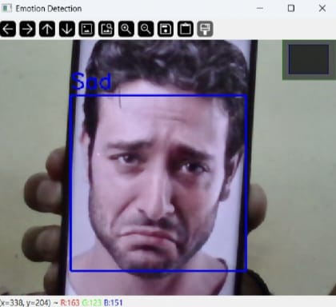
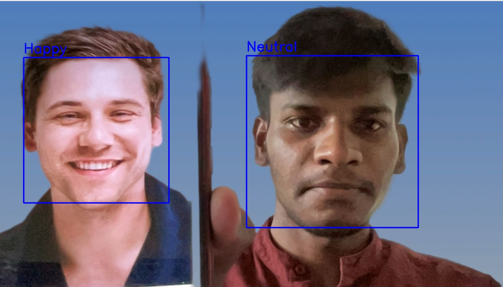
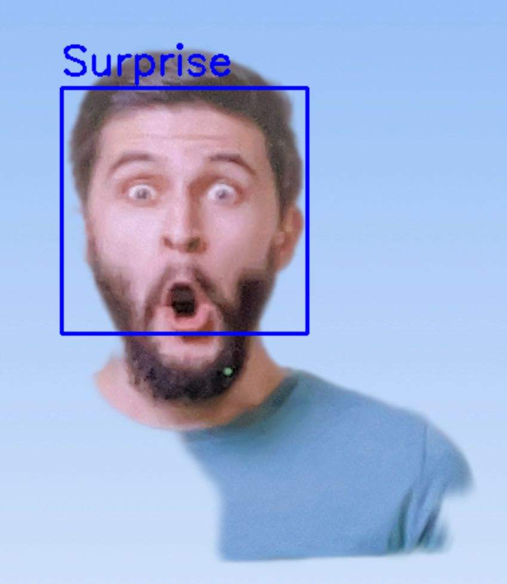

# Real-Time-Emotion-Detection

# 📌 Introduction 
This project aims to classify emotions on a person's face into one of seven categories using deep convolutional neural networks (CNNs). The model is trained on the FER-2013 dataset, which was introduced at the International Conference on Machine Learning (ICML). The dataset consists of 35,887 grayscale images (48x48 pixels), categorized into seven emotions: 
      😠 Angry | 🤢 Disgusted | 😨 Fearful | 😃 Happy | 😐 Neutral | 😢 Sad | 😲 Surprised

# 📌 Dataset and Data Preparation

- The FER-2013 dataset consists of 35,887 grayscale images (48x48 pixels), available in CSV format on Kaggle.
- It is preprocessed by converting the images from the CSV file into PNG format for easy loading and training.
- The dataset is split into Training (80%) and Validation (20%).
- Preprocessing steps include:
  - Normalizing pixel values
  - Data augmentation (flipping, rotation, zooming)
  - Converting images to grayscale
- The preprocessing script can be found in dataset_prepare.py.

# 🔍 Algorithm Overview
1. Face Detection: 

  - Uses Haar Cascade Classifier to detect faces in frames.

2.Preprocessing:

  - Detected faces are cropped, resized (48x48 pixels), and normalized.

3.CNN Model for Emotion Classification:

  - A deep Convolutional Neural Network (CNN) is trained to predict emotions.                       
  - It outputs softmax scores for seven emotion classes.

# 📌 Real-Time Implementation
- The trained model is integrated with OpenCV to capture live video input.
- The detected face is processed and fed into the CNN for emotion prediction.
- The predicted emotion is displayed in real time with bounding boxes and labels

# Display Results:

  - The emotion with the highest probability is displayed in real time on the screen.

  
  

  

# 🔗  References

"Challenges in Representation Learning: A report on three machine learning contests." - I. Goodfellow et al., 2013

